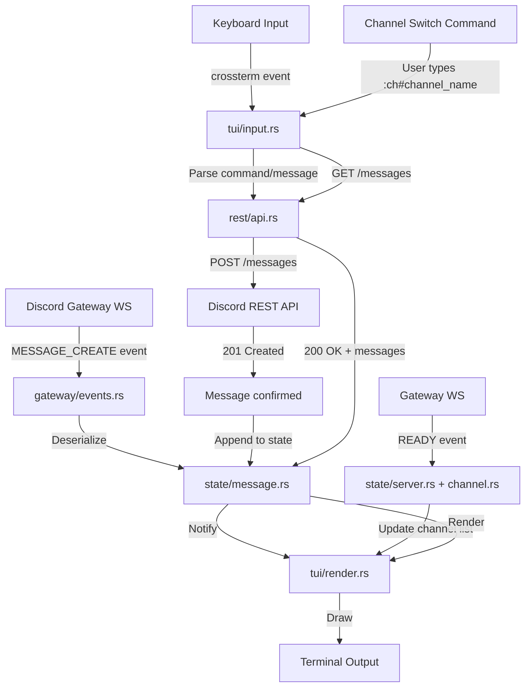
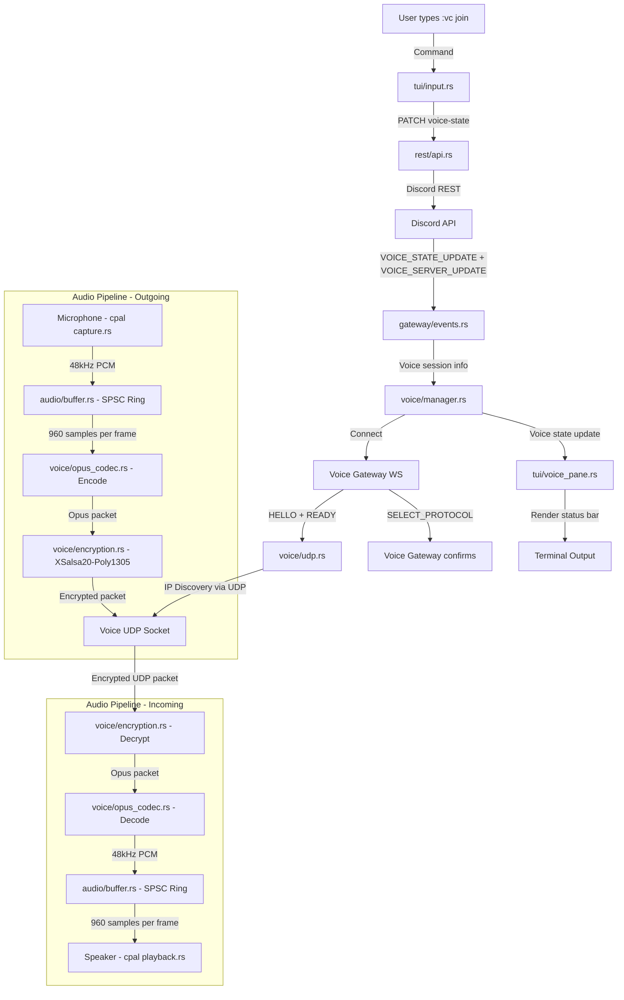
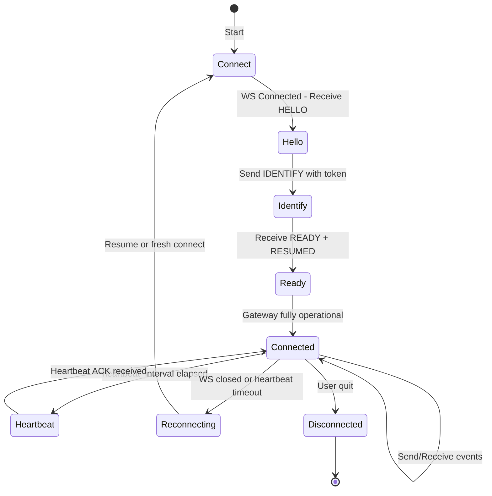

# dcrd — Ultra-Low-RAM Discord Client Architecture

> **Goal:** A Discord client that does exactly two things — join voice channels and send/receive text messages — using the absolute minimum RAM possible on Windows 11.  
> **Target:** < 30 MB resident set size under normal operation.

---

## 1. Technology Stack Selection

### 1.1 Language Comparison

| Criterion | Rust + Tokio | Go + discordgo | C/C++ raw | Zig |
|---|---|---|---|---|
| Idle process RSS | 2–5 MB | 8–12 MB | 1–3 MB | 2–4 MB |
| Discord library ecosystem | **serenity** (mature, full gateway) | **discordgo** (mature, full gateway) | None — raw WebSocket | None — raw WebSocket |
| Voice gateway support | **songbird** (built on serenity, Opus + UDP) | Partial / manual | Manual | Manual |
| Async runtime overhead | tokio ~1.5 MB | goroutine scheduler ~3 MB | None (manual epoll) | None (manual) |
| Memory safety | ✓ (compile-time) | ✓ (GC-assisted) | ✗ (manual) | ✓ (compile-time) |
| Windows support | ✓ (first-class) | ✓ (first-class) | ✓ (manual) | ✓ (experimental) |
| Build complexity | Moderate | Low | Very High | High |
| Cross-compile ease | Good | Excellent | Poor | Good |

### 1.2 Decision: Rust + Tokio

**Rationale:**

1. **Lowest RAM with real Discord support.** Rust + tokio gives us a ~3 MB idle baseline. Go's GC adds ~5 MB minimum overhead before any application code runs. C/C++ could go lower but requires building the entire Discord gateway + voice stack from scratch — months of work for protocol handling that serenity/songbird already provide.

2. **songbird** is the only mature Rust voice library that handles Discord's voice gateway handshake, Opus encoding/decoding, and UDP packet framing out of the box. No other language has an equivalent that is both maintained and memory-efficient.

3. **Zero-cost abstractions** mean we only pay for what we use. No GC overhead, no runtime bloat. The compiler eliminates unused code paths entirely.

4. **tokio** with `current_thread` runtime (not multi-threaded) reduces scheduler overhead from ~1.5 MB to ~0.5 MB since we don't need a thread pool — our workload is I/O-bound with two async tasks (gateway + voice).

5. **cpal** for audio I/O is the leanest cross-platform Rust audio library — it wraps WASAPI on Windows with minimal overhead (~200 KB).

### 1.3 UI Decision: Terminal UI with ratatui

| UI Option | RAM Overhead | Visual Quality | Complexity |
|---|---|---|---|
| **ratatui (TUI)** | ~0.5 MB | Good — styled, layout-based | Low |
| crossterm (raw) | ~0.1 MB | Minimal — no layout | Very Low |
| FLTK (native GUI) | ~3–5 MB | Good | Medium |
| SDL2 | ~5–8 MB | Excellent | High |
| egui (immediate GUI) | ~4–6 MB | Good | Medium |

**Decision: ratatui + crossterm**

- Adds only ~0.5 MB overhead vs raw terminal
- Provides proper layout engine, styled text, scrollable message history
- crossterm handles Windows terminal escape codes correctly (important — Windows Terminal + ConPTY)
- Zero GPU memory usage — pure terminal rendering
- The TUI will have two panes: text chat (left/top) and voice status bar (bottom)

---

## 2. Dependency List & RAM Footprint Estimates

### 2.1 Core Dependencies

| Crate | Purpose | Est. RSS Contribution |
|---|---|---|
| `tokio` (current_thread) | Async runtime — single-threaded scheduler | 0.5 MB |
| `serenity` (with minimal features) | Discord Gateway WebSocket — events, REST API | 2.0 MB |
| `songbird` | Discord Voice Gateway + UDP + Opus | 1.5 MB |
| `opus` (sys bindings) | Opus codec — encode/decode voice | 0.3 MB |
| `cpal` | Audio capture/playback via WASAPI | 0.2 MB |
| `ratatui` | Terminal UI framework | 0.5 MB |
| `crossterm` | Terminal backend for ratatui | 0.1 MB |
| `tokio-tungstenite` | WebSocket transport (used by serenity) | 0.3 MB |
| `reqwest` (rustls, no default-tls) | HTTPS for Discord REST API | 0.8 MB |
| `rustls` | TLS implementation — lighter than OpenSSL | 0.5 MB |
| `ring` | Crypto primitives for rustls | 0.3 MB |
| `serde` + `serde_json` | JSON serialization | 0.3 MB |
| `tracing` | Structured logging | 0.1 MB |
| `dashmap` | Concurrent state maps | 0.2 MB |

### 2.2 Feature-Gating Strategy (Critical for RAM)

**serenity** must be imported with ONLY these features enabled:

```toml
serenity = { version = "0.12", default-features = false, features = [
    "gateway",        # WebSocket gateway connection
    "rustls",         # TLS via rustls (not native-tls/OpenSSL)
    "model",          # Discord data models
    "builder",        # Message/channel builders
] }
# EXCLUDE: "client", "framework", "standard_framework", "cache", "http_proxy"
# We build our own minimal client and skip the cache entirely
```

**songbird** must be imported with minimal features:

```toml
songbird = { version = "0.4", default-features = false, features = [
    "rustls",         # TLS via rustls
    "opus",           # Opus codec support
    "receive",        # Receive audio from VC
] }
# EXCLUDE: "serenity" (we wire it manually), "twilight", "driver"
```

**reqwest** must avoid OpenSSL:

```toml
reqwest = { version = "0.12", default-features = false, features = [
    "rustls-tls",     # TLS via rustls
    "json",           # serde_json integration
] }
# EXCLUDE: "default-tls", "cookies", "stream", "multipart"
```

### 2.3 Total Estimated RSS Budget

| Component | RAM |
|---|---|
| Rust runtime (allocator + stack) | 1.0 MB |
| tokio current_thread runtime | 0.5 MB |
| serenity (gateway + models, no cache) | 2.0 MB |
| songbird + opus | 1.8 MB |
| cpal + WASAPI buffers | 0.7 MB |
| ratatui + crossterm | 0.6 MB |
| reqwest + rustls + ring | 1.6 MB |
| serde + serde_json | 0.3 MB |
| Application state (channels, messages buffer) | 2.0 MB |
| Audio ring buffers (3 × 960 samples × 2 bytes × 2 channels) | 0.1 MB |
| Message history cache (last 200 messages) | 1.0 MB |
| Discord gateway receive buffer | 0.5 MB |
| Misc (tracing, dashmap, small allocs) | 0.5 MB |
| **TOTAL** | **~12.6 MB** |

This leaves **~17 MB headroom** under the 30 MB target for spikes during connection, large messages, or voice reconnection events.

---

## 3. Module Breakdown

```
dcrd/
├── Cargo.toml
├── src/
│   ├── main.rs              # Entry point, tokio runtime init
│   ├── config.rs            # Token loading, user preferences
│   ├── gateway/
│   │   ├── mod.rs           # Gateway module root
│   │   ├── connection.rs    # WebSocket connection lifecycle
│   │   ├── events.rs        # Event dispatch (MESSAGE_CREATE, etc.)
│   │   ├── heartbeat.rs     # Heartbeat/keepalive logic
│   │   └── identify.rs      # IDENTIFY payload construction
│   ├── voice/
│   │   ├── mod.rs           # Voice module root
│   │   ├── manager.rs       # Voice connection manager
│   │   ├── udp.rs           # UDP voice data transport
│   │   ├── encryption.rs    # XSalsa20-Poly1305 encryption
│   │   └── opus_codec.rs    # Opus encode/decode wrapper
│   ├── audio/
│   │   ├── mod.rs           # Audio module root
│   │   ├── capture.rs       # Microphone input via cpal
│   │   ├── playback.rs      # Speaker output via cpal
│   │   └── buffer.rs        # Lock-free ring buffers
│   ├── tui/
│   │   ├── mod.rs           # TUI module root
│   │   ├── app.rs           # Application state machine
│   │   ├── render.rs        # ratatui rendering logic
│   │   ├── chat_pane.rs     # Message list + input area
│   │   ├── voice_pane.rs    # Voice channel status bar
│   │   └── input.rs         # Keyboard event handling
│   ├── state/
│   │   ├── mod.rs           # State module root
│   │   ├── server.rs        # Server/guild minimal models
│   │   ├── channel.rs       # Channel models (text + voice)
│   │   ├── message.rs       # Message model + ring buffer
│   │   └── user.rs          # User model (self only, no full cache)
│   └── rest/
│       ├── mod.rs           # REST API module root
│       └── api.rs           # Minimal REST calls (send msg, join VC)
```

### 3.1 Module Responsibilities

#### `main.rs`
- Creates single-threaded tokio runtime: `tokio::runtime::Builder::new_current_thread()`
- Loads config (Discord token from env var or file)
- Spawns gateway task, TUI task, and audio bridge
- Handles graceful shutdown via `Ctrl+C`

#### `gateway/`
- Manages the Discord Gateway WebSocket connection (wss://gateway.discord.gg/?v=10&encoding=json)
- Handles the full lifecycle: CONNECT → HELLO → IDENTIFY → RESUME
- Dispatches incoming events to state and TUI
- Sends heartbeats at the interval specified in HELLO payload
- **Does NOT use serenity's Client or Cache** — we use only the raw gateway event types and model structs

#### `voice/`
- Implements Discord Voice Gateway connection (separate WebSocket per voice session)
- Handles voice handshake: VOICE_STATE_UPDATE → VOICE_SERVER_UPDATE → Voice WebSocket → SELECT_PROTOCOL → UDP handshake
- Manages UDP voice data transport on the IP/port returned by Voice Gateway
- Handles XSalsa20-Poly1305 encryption of outgoing voice packets and decryption of incoming
- Wraps the `opus` crate for encoding captured PCM → Opus and decoding Opus → PCM for playback

#### `audio/`
- Uses `cpal` with WASAPI backend on Windows
- **Capture:** Opens default input device at 48kHz mono 16-bit PCM, feeds samples into a lock-free SPSC ring buffer
- **Playback:** Reads decoded PCM from a ring buffer, writes to default output device at 48kHz mono 16-bit PCM
- Ring buffer size: 960 samples per Opus frame (20ms at 48kHz), triple-buffered for jitter tolerance

#### `tui/`
- ratatui-based terminal interface with two regions:
  - **Chat pane** (top 80%): scrollable message history + text input at bottom
  - **Voice bar** (bottom 20% or 2-line status): current VC name, connected users, mute/deafen status
- Input handling: keyboard events via crossterm, vim-like keybindings
- Renders at 30 FPS max (capped via tick rate to reduce CPU/RAM from rendering)

#### `state/`
- Minimal in-memory state — NO full Discord cache
- Stores: current user, selected server, selected channel, last 200 messages (ring buffer), voice state
- Uses `DashMap` for concurrent access between gateway task and TUI task
- Messages are stored in a `VecDeque<Message>` with max capacity 200 — oldest evicted on overflow

#### `rest/`
- Thin wrapper over `reqwest` for Discord REST API calls
- Only implements endpoints we need:
  - `POST /channels/{id}/messages` — send text message
  - `PATCH /guilds/{id}/voice-states/{user}` — join/leave VC
  - `GET /channels/{id}/messages` — fetch recent messages on channel switch
- Rate limit handling: simple token bucket per-route

---

## 4. Data Flow Diagrams

### 4.1 Text Chat Data Flow



### 4.2 Voice Data Flow



### 4.3 Gateway Connection Lifecycle



---

## 5. Discord Protocol Details

### 5.1 Gateway WebSocket (Text Chat)

**Connection URL:**  
`wss://gateway.discord.gg/?v=10&encoding=json`

**Key Events We Handle:**

| Event | Direction | Purpose |
|---|---|---|
| `READY` | Server→Client | Initial state — user info, guilds, channels |
| `MESSAGE_CREATE` | Server→Client | New message in text channel |
| `MESSAGE_UPDATE` | Server→Client | Edited message |
| `MESSAGE_DELETE` | Server→Client | Deleted message |
| `GUILD_CREATE` | Server→Client | Server info on connect |
| `CHANNEL_CREATE` | Server→Client | New channel |
| `VOICE_STATE_UPDATE` | Server→Client | User joined/left VC (includes ourselves) |
| `VOICE_SERVER_UPDATE` | Server→Client | Voice connection info for VC join |
| `HEARTBEAT_ACK` | Server→Client | Confirm heartbeat received |

**Heartbeat Protocol:**
1. Receive `HELLO` with `heartbeat_interval` (typically 41,250 ms)
2. Send first `HEARTBEAT` after random jitter (0..interval)
3. Send `HEARTBEAT` every interval thereafter
4. Must receive `HEARTBEAT_ACK` before next heartbeat send
5. If no ACK → close WS → reconnect with RESUME

**Identify Payload (minimal):**
```json
{
  "op": 2,
  "d": {
    "token": "BOT_TOKEN",
    "intents": 3072,
    "properties": {
      "os": "windows",
      "browser": "dcrd",
      "device": "dcrd"
    },
    "compress": false
  }
}
```

**Intents:** `3072` = `GUILD_MESSAGES` (1 << 9) + `GUILD_VOICE_STATES` (1 << 7) — we request ONLY the intents we need.

### 5.2 Voice Gateway + UDP (Voice Chat)

**Voice Connection Sequence:**

1. **Client sends VOICE_STATE_UPDATE** via main Gateway:
   ```json
   {
     "op": 4,
     "d": {
       "guild_id": "GUILD_ID",
       "channel_id": "CHANNEL_ID",
       "self_mute": false,
       "self_deaf": false
     }
   }
   ```

2. **Discord sends VOICE_STATE_UPDATE** back with session_id

3. **Discord sends VOICE_SERVER_UPDATE** with endpoint token + guild_id + endpoint URL

4. **Client connects to Voice Gateway WS:**  
   `wss://ENDPOINT/?v=8`

5. **Voice Hello → Identify:**
   ```json
   { "op": 0, "d": { "server_id": "GUILD_ID", "user_id": "USER_ID", "session_id": "SESSION_ID", "token": "TOKEN" } }
   ```

6. **Voice Ready** returns: `ip`, `port`, `ssrc`, `modes` (encryption algorithms)

7. **UDP IP Discovery:** Client sends 70-byte packet (4 bytes SSRC + 66 null bytes) to the voice UDP endpoint. Server responds with client's external IP + port.

8. **Client sends SELECT_PROTOCOL:**
   ```json
   {
     "op": 1,
     "d": {
       "protocol": "udp",
       "data": { "address": "EXTERNAL_IP", "port": EXTERNAL_PORT, "mode": "xsalsa20_poly1305" }
     }
   }
   ```

9. **Voice Gateway confirms** with SESSION_DESCRIPTION containing the encryption key.

10. **Audio streaming begins** — 20ms Opus frames sent via UDP, encrypted with XSalsa20-Poly1305.

**Voice Packet Structure (outgoing):**

```
[0-1]  Header: rtp_version (2) + padding (0) + extension (0) + csrc_count (0)
[2]    Payload type: 0x78 (120)
[3-4]  Sequence number (uint16, incrementing)
[5-8]  Timestamp (uint32, incrementing by 960 per frame)
[9-12] SSRC (uint32)
[13-28] Nonce (16 bytes, derived from header)
[29+]  Encrypted Opus payload + Poly1305 MAC (16 bytes)
```

**Opus Configuration:**
- Sample rate: 48000 Hz
- Channels: 1 (mono — Discord uses mono for voice)
- Frame size: 960 samples (20 ms at 48 kHz)
- Bitrate: 64 kbps (Discord default)
- Application: VOIP

### 5.3 Encryption: XSalsa20-Poly1305

Discord supports multiple encryption modes. We use `xsalsa20_poly1305` (the most widely supported):

- **Key:** 32 bytes from SESSION_DESCRIPTION
- **Nonce:** 24 bytes — first 12 bytes are the RTP header (bytes 0–11), remaining 12 bytes are zero
- **Additional Data:** None for `xsalsa20_poly1305` mode
- The `tweetnacol` or `sodiumoxide` crate provides this via libsodium bindings

**Recommended crate:** `nacl` or `sodiumoxide` — both wrap libsodium which provides `crypto_secretbox_xsalsa20poly1305`. The `songbird` crate already handles this internally, so we may not need a separate crate if we use songbird's driver.

---

## 6. TUI Design Specification

### 6.1 Layout

```
┌──────────────────────────────────────────────────────┐
│ dcrd │ #general │ Guild Name                         │  ← Title bar
├──────────────────────────────────────────────────────┤
│                                                      │
│  [12:30] Alice: Hey everyone!                        │  ← Message area
│  [12:31] Bob: What's up?                             │     (scrollable)
│  [12:32] Alice: Just joining VC                      │
│  [12:33] Charlie: Same                               │
│                                                      │
│                                                      │
├──────────────────────────────────────────────────────┤
│ > Type message here...________________________       │  ← Input area
├──────────────────────────────────────────────────────┤
│ 🔊 Voice: General Voice │ Users: Alice, Bob, Charlie │  ← Voice status bar
│ Muted: No │ Deafened: No │ :help for commands        │
└──────────────────────────────────────────────────────┘
```

### 6.2 Keybindings

| Key | Action |
|---|---|
| `Enter` | Send message |
| `Up/Down` | Scroll message history |
| `Ctrl+Up/Down` | Switch channel |
| `Ctrl+M` | Toggle self-mute |
| `Ctrl+D` | Toggle self-deafen |
| `:vc join` | Join voice channel of current server |
| `:vc leave` | Leave voice channel |
| `:ch #name` | Switch to text channel |
| `:srv name` | Switch to server/guild |
| `:quit` | Exit application |
| `Tab` | Toggle focus between chat and command input |

### 6.3 Rendering Strategy

- **Tick rate:** 30 FPS (33ms interval) — sufficient for chat, minimal CPU
- **Only re-render on state change** — use ratatui's `Terminal::draw()` with diffing
- **Message rendering:** Timestamps in dim gray, usernames in unique per-user colors (hash-based), message text in white
- **Voice bar:** Always visible at bottom, 2 lines tall

---

## 7. Memory Budget Breakdown

### 7.1 Static Allocations (at startup)

| Allocation | Size | Notes |
|---|---|---|
| tokio runtime | 512 KB | Single-threaded, minimal slab |
| Gateway WS buffers | 256 KB | tungstenite read/write buffers |
| Voice WS buffers | 256 KB | tungstenite read/write buffers |
| Voice UDP socket buffer | 128 KB | OS-level socket recv buffer |
| Opus encoder state | ~20 KB | Opus encoder alloc |
| Opus decoder state | ~20 KB | Per-stream decoder alloc |
| ratatui terminal buffer | ~200 KB | Backbuffer for diff rendering |
| crossterm state | ~10 KB | Terminal state tracking |

### 7.2 Dynamic Allocations (runtime)

| Allocation | Max Size | Notes |
|---|---|---|
| Message ring buffer | 1.0 MB | 200 messages × ~5 KB avg |
| Channel list | 50 KB | ~100 channels × 500 bytes |
| Server list | 10 KB | ~10 servers × 1 KB |
| Audio capture ring | 11.5 KB | 3 × 960 × 2 bytes (triple-buffered) |
| Audio playback ring | 11.5 KB | 3 × 960 × 2 bytes (triple-buffered) |
| Voice jitter buffer | 46 KB | 4 × 20ms frames buffered |
| REST response bodies | 100 KB | Temporary, freed after parse |
| Gateway event deserialization | 50 KB | Temporary per-event, freed |
| TLS session state | 200 KB | rustls session + cipher state |

### 7.3 Total Memory Map

```
┌─────────────────────────────┐  0x000000
│ .text (code)                │  ~3 MB (stripped, LTO)
├─────────────────────────────┤
│ .rodata (constants)         │  ~0.5 MB
├─────────────────────────────┤
│ .data + .bss (globals)      │  ~0.2 MB
├─────────────────────────────┤
│ Stack (8 MB default)        │  ~0.1 MB used
├─────────────────────────────┤
│ Heap (via global_alloc)     │  ~8 MB peak
│  ├── tokio runtime          │  0.5 MB
│  ├── WS buffers             │  0.5 MB
│  ├── Message cache          │  1.0 MB
│  ├── Audio buffers          │  0.1 MB
│  ├── TLS state              │  0.2 MB
│  ├── Opus state             │  0.04 MB
│  ├── TUI buffers            │  0.2 MB
│  ├── Channel/Server state   │  0.06 MB
│  └── Misc temp allocs       │  0.5 MB
├─────────────────────────────┤
│                              │
│  HEADROOM                    │  ~17 MB
│                              │
└─────────────────────────────┘  ~12.6 MB total RSS
```

---

## 8. Build Instructions for Windows 11

### 8.1 Prerequisites

1. **Rust toolchain** (MSVC target):
   ```powershell
   # Install rustup
   winget install Rustlang.Rustup
   rustup default stable-msvc
   rustup target add x86_64-pc-windows-msvc
   ```

2. **C/C++ Build tools** (required for native crate compilation):
   ```powershell
   # Install Visual Studio Build Tools
   winget install Microsoft.VisualStudio.2022.BuildTools
   # Select: "C++ build tools" workload
   ```

3. **libsodium** (required for voice encryption via songbird):
   ```powershell
   # Install via vcpkg
   git clone https://github.com/microsoft/vcpkg.git C:\vcpkg
   C:\vcpkg\bootstrap-vcpkg.bat
   C:\vcpkg\vcpkg install libsodium:x64-windows
   set SODIUM_LIB_DIR=C:\vcpkg\installed\x64-windows\lib
   set SODIUM_INCLUDE_DIR=C:\vcpkg\installed\x64-windows\include
   ```
   **Alternative:** Use the `libsodium-sys` crate which can build from source — set `SODIUM_BUILD_FROM_SOURCE=1` if vcpkg is not available.

4. **Opus** (required for voice codec):
   ```powershell
   # Install via vcpkg
   C:\vcpkg\vcpkg install opus:x64-windows
   set OPUS_LIB_DIR=C:\vcpkg\installed\x64-windows\lib
   set OPUS_INCLUDE_DIR=C:\vcpkg\installed\x64-windows\include
   ```
   **Alternative:** The `opus-sys` crate can build from source — set `LIBOPUS_BUILD_FROM_SOURCE=1`.

### 8.2 Build Commands

```powershell
# Clone the repo (already initialized)
cd h:\discrd

# Debug build (faster compile, larger binary)
cargo build

# Release build (optimized, minimal RAM)
cargo build --release

# Run with Discord token
set DCRD_TOKEN=your_bot_token_here
cargo run --release

# Or with user token (for user account — not recommended, against ToS)
set DCRD_TOKEN=your_user_token_here
cargo run --release
```

### 8.3 Cargo.toml Optimization for Size/RAM

```toml
[profile.release]
opt-level = "z"      # Optimize for size (also helps cache locality → less RAM)
lto = true           # Link-Time Optimization — eliminates dead code across crates
codegen-units = 1    # Single codegen unit — better optimization, slower compile
strip = true         # Strip debug symbols from binary
panic = "abort"      # Abort on panic — no unwind tables (saves ~100 KB)
```

### 8.4 Optional: UPX Compression

For even smaller binary size (does not affect RSS, only disk size):
```powershell
winget install UPX.UPX
upx --best target/release/dcrd.exe
```

---

## 9. Implementation Order (Todo List)

The implementation should proceed in this order to allow incremental testing:

### Phase 1: Skeleton + Gateway
1. Initialize Cargo project with feature-gated dependencies
2. Implement `config.rs` — load token from `DCRD_TOKEN` env var
3. Implement `gateway/connection.rs` — connect to Discord Gateway WS
4. Implement `gateway/identify.rs` — send IDENTIFY, receive READY
5. Implement `gateway/heartbeat.rs` — heartbeat loop
6. Implement `gateway/events.rs` — parse MESSAGE_CREATE, GUILD_CREATE, CHANNEL_CREATE
7. Implement `state/` — minimal models for servers, channels, messages
8. **Test:** Connect to gateway, receive events, print to stdout

### Phase 2: Text Chat + TUI
9. Implement `tui/` — ratatui setup with chat pane + input
10. Implement `tui/input.rs` — keyboard handling, message input
11. Implement `rest/api.rs` — send message endpoint
12. Implement `tui/chat_pane.rs` — render messages, scroll, input
13. Implement channel switching (`:ch` command)
14. **Test:** Send and receive text messages in TUI

### Phase 3: Voice Connection
15. Implement `voice/manager.rs` — voice state update handling
16. Implement Voice Gateway WS connection
17. Implement `voice/udp.rs` — UDP transport + IP discovery
18. Implement `voice/encryption.rs` — XSalsa20-Poly1305 encrypt/decrypt
19. Implement `voice/opus_codec.rs` — Opus encode/decode wrapper
20. **Test:** Connect to VC, see voice state updates in TUI

### Phase 4: Audio Pipeline
21. Implement `audio/capture.rs` — microphone input via cpal
22. Implement `audio/playback.rs` — speaker output via cpal
23. Implement `audio/buffer.rs` — lock-free SPSC ring buffers
24. Wire capture → Opus encode → encrypt → UDP send
25. Wire UDP recv → decrypt → Opus decode → playback
26. Implement `tui/voice_pane.rs` — voice status bar
27. **Test:** Full voice chat — speak and hear others

### Phase 5: Polish + Optimization
28. Add `:vc join` / `:vc leave` / `:srv` commands
29. Add mute/deafen toggle (Ctrl+M, Ctrl+D)
30. Profile RSS with Windows Task Manager / `vmmap`
31. Optimize any allocations exceeding budget
32. Add graceful shutdown (Ctrl+C cleanup)
33. Final RSS validation — confirm < 30 MB

---

## 10. Risk Assessment & Mitigations

| Risk | Impact | Mitigation |
|---|---|---|
| serenity pulls in unwanted features/bloat | Higher RSS than budgeted | Use `default-features = false`, audit `cargo tree --features` |
| songbird + serenity version conflict | Build failure | Pin compatible versions, may need to use songbird's git rev |
| libsodium/opus build issues on Windows | Build complexity | Provide vcpkg instructions + fallback source-build env vars |
| cpal WASAPI latency | Audio delay/glitches | Use 20ms buffer size matching Opus frame, test with different buffer counts |
| Discord rate limits on REST | Failed message sends | Implement per-route token bucket, respect Retry-After header |
| Gateway disconnect/resume | Lost events during reconnect | Implement RESUME opcode with last_received_seq, re-send IDENTIFY if session invalid |
| Voice encryption mode mismatch | Cannot connect to VC | Fallback to `aead_xchacha20_poly1305_rtpsize` if `xsalsa20_poly1305` not offered |
| User token vs Bot token | Different auth flows | Support both — bot token for official bots, user token for personal use (with ToS warning) |

---

## 11. Key Design Decisions Summary

| Decision | Choice | Why |
|---|---|---|
| Language | Rust | Lowest RAM with mature Discord libs |
| Async runtime | tokio current_thread | Single-threaded = ~1 MB less than multi-threaded |
| Discord library | serenity (minimal features) | Only mature Rust gateway lib, feature-gatable |
| Voice library | songbird | Only Rust voice lib with Opus + encryption |
| TLS | rustls | ~2 MB lighter than native-tls/OpenSSL |
| UI | ratatui + crossterm | ~0.5 MB overhead, good-looking TUI |
| Audio | cpal | Thinnest WASAPI wrapper, ~200 KB |
| Allocator | System (jemalloc optional) | System allocator is fine at this scale; jemalloc could save ~0.5 MB if needed |
| Message cache | VecDeque with cap 200 | Bounded memory, O(1) push with eviction |
| Compression | Disabled on gateway | `compress: false` in IDENTIFY — saves zlib overhead (~200 KB) |
| Encoding | JSON (not ETF) | JSON is simpler; ETF would save ~5% bandwidth but adds dependency complexity |

---

## 12. Cargo.toml Reference

```toml
[package]
name = "dcrd"
version = "0.1.0"
edition = "2021"
description = "Ultra-low-RAM Discord client — voice + text only"

[dependencies]
tokio = { version = "1", features = ["rt", "macros", "sync", "time", "net", "io-util"] }
serenity = { version = "0.12", default-features = false, features = ["gateway", "rustls", "model", "builder"] }
songbird = { version = "0.4", default-features = false, features = ["rustls", "opus", "receive"] }
opus = "0.3"
cpal = "0.15"
ratatui = "0.28"
crossterm = "0.28"
reqwest = { version = "0.12", default-features = false, features = ["rustls-tls", "json"] }
serde = { version = "1", features = ["derive"] }
serde_json = "1"
tracing = "0.1"
tracing-subscriber = "0.3"
dashmap = "6"
crossbeam-queue = "0.3"   # Lock-free SPSC for audio buffers

[profile.release]
opt-level = "z"
lto = true
codegen-units = 1
strip = true
panic = "abort"
```

---

*This architecture is designed to be handed directly to the Developer subagent for implementation. All protocol details, dependency versions, memory budgets, and build instructions are specified to minimize ambiguity.*
